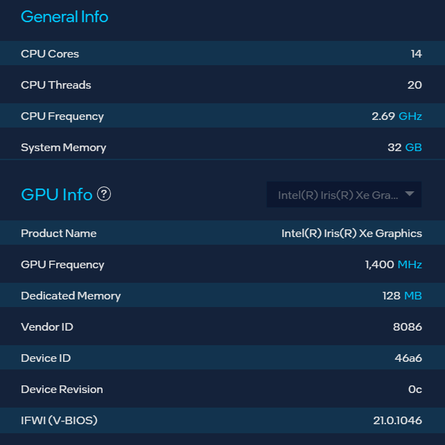
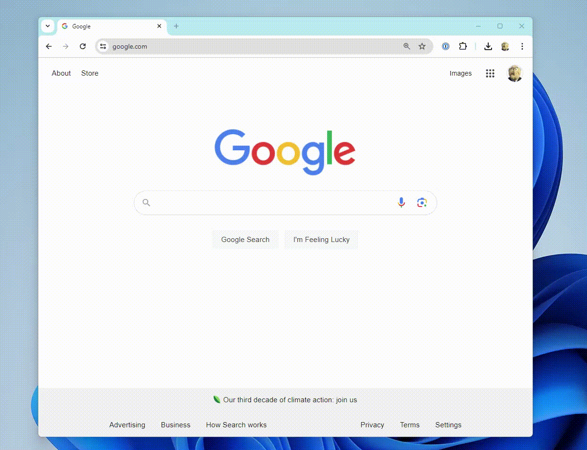

# Intel Driver Indirect Call Hang WebGPU/Chrome

## Overview
This repository provides an minimal reproduction where a valid WebGPU program run in Google Chrome causes a Direct3d driver hang on some intel hardware. The example simply draws a triangle some fixed number of times per frame using an indirect draw call. The issue has been reproduced on multiple identical laptops.

## System Information
* Dell Precision 5570
* Windows 11: 10.0.22631 Build 22631
* Processor	12th Gen Intel(R) Core(TM) i7-12700H, 2300 Mhz, 14 Core(s), 20 Logical Processor(s)
* BIOS Version/Date	Dell Inc. 1.23.0, 4/10/2024
* Chrome 126.0.6478.127


* [SSU.txt](./SSU.txt)
* Tested with:
  * Dell Driver: 1/18/2024 31.0.101.5186
  * Intel Driver: 7/4/2024 32.0.101.5762

## Steps to Reproduce
1. Get a hardware/software configuration equivalent to the one described above
2. Install and run Google Chrome
3. Open index.html
4. Expected Behavior: Draws a black square with a red triangle


   
5. Actual Behavior
   * Draws a black square
   * The developer console presents the following error:
   ```
    D3D12 create command allocator failed with DXGI_ERROR_DEVICE_REMOVED (0x887A0005)
       at CheckHRESULTImpl (..\..\third_party\dawn\src\dawn\native\d3d\D3DError.cpp:117)

    Backend messages:
     * Device removed reason: DXGI_ERROR_DEVICE_HUNG (0x887A0006)
   ```

[Reproduction Video](./reproduction_video.mp4)


### Notes
* The number of draw calls configured is relative low (256)
* If you lower it to 10 (setting `const INDIRECT_DRAW_COUNT = 10;`) it appears to work.
* The example works fine on the same machine using the discrete graphics card
* Happens with or without the power cable attached